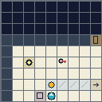
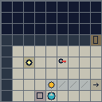
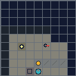

# Micro-Transformer R&D suite: artifacts and orientation

This page is a guided inventory of the main things in the Micro-Transformer
research and development suite: the language and data pipeline, model source and
checkpoint, inference harness, training and evaluation tools, experiment records,
and Micro-World. It gives you context before the how-to guides and points to the
authoritative files and deeper explanations.

Micro-Transformer is an inspectable small-model research toolkit. It is useful
for learning, prototyping, and controlled experiments. It is not a general-purpose
chat model or a production agent platform. Its components are designed to be
understood and evaluated separately.

## How to read this catalog

Here, *artifact* means a useful project output or component: source code, a
versioned model, data contract, evaluation record, or visual. Some artifacts are
committed to this repository; run-specific datasets, checkpoints, logs, and reports
are normally generated under the ignored `artifacts/` directory. The
[artifact-directory README](https://github.com/vimalnar/micro-transformer/blob/main/artifacts/README.md)
explains that local output area.

| Element | Purpose | Representative artifacts | Start here |
| --- | --- | --- | --- |
| Language and semantics | Define exactly what token sequences mean | Ordered 128-token vocabulary, grammar, interpreter, invalid-input rules | [Language reference](reference/micro-transformer-language.md) |
| Data generation | Produce and validate reproducible language episodes | Generator, schemas, sample JSONL, manifests and split checks | [Data generation v4](specifications/data-generation-v4.md) |
| Transformer | Provide a small, inspectable causal language model | Model source, configurations, parameter specifications and architecture diagram | [Transformer architecture](specifications/transformer-architecture.md) |
| Frozen baseline | Give users a versioned checkpoint for repeatable inference | v1.0.0 manifest, model card, dataset card and seed-42 checkpoint | [Baseline files](https://github.com/vimalnar/micro-transformer/tree/main/baselines/v1.0.0) |
| Harness | Run the frozen checkpoint with prompt and artifact checks | CLI, self-test, fixed verified examples and named failure cases | [Harness guide](guides/harness.md) |
| Training and inference | Train from scratch, evaluate, and run tensor-level inference | Configurations and commands; run outputs are kept separately | [Workflow guide](guides/training-and-inference.md) |
| Evaluation suite | State what was measured and retain the underlying decisions | Benchmark manifest, reference results, raw decisions and report schema | [Readiness and results](results/v1-readiness-audit.md) |
| Micro-World | Supply a deterministic grid simulation with partial observations | Simulation, typed actions, observation renderer, service, inspector and bounded reference experiment | [Gridworld specification](specifications/gridworld-v1.md) |
| Worked examples | Make small, inspectable exercises for learners and evaluators | In-repository examples and a companion case collection | [Examples guide](guides/examples.md) |
| Reproducibility and governance | Identify versions, evidence, limitations and contribution rules | Suite manifests, hashes, reports, citation metadata, license and contribution guide | [Reproducibility](guides/reproducibility.md) · [Contributing](guides/contributing.md) |

## 1. Language and generated data

The model is trained on a fixed formal language, not unrestricted English. The
repository's language package owns the ordered vocabulary, grammar, task
construction and reference interpreter. The interpreter supplies independently
derived labels for generated episodes; it is not part of the model's forward pass
or the frozen harness's answer path.

The data pipeline produces versioned records and checks properties such as
validity, coverage, duplicate handling, provenance and split separation. A small
representative record set is included in
[`baselines/v1.0.0/sample-training-data.jsonl`](https://github.com/vimalnar/micro-transformer/blob/main/baselines/v1.0.0/sample-training-data.jsonl).
It is an example of the data format, not a replacement for the full training
corpus. The exact language and generator contracts are in the
[language reference](reference/micro-transformer-language.md) and
[data-generation specification](specifications/data-generation-v4.md).

## 2. Model source and checkpoints

The canonical model implementation is [`models/transformer.py`](https://github.com/vimalnar/micro-transformer/blob/main/models/transformer.py).
The small v1.0.0 reference is a five-layer, width-128 decoder-only transformer
with four attention heads, a 128-token context, and 1,024,512 parameters. Its
versioned seed-42 inference checkpoint is included in the repository. The
[model card](https://github.com/vimalnar/micro-transformer/blob/main/baselines/v1.0.0/model-card.md)
describes intended use, measured suites and limitations.


*Architecture diagram: the optional LoRA extension is shown for context; it is
not active in the bundled baseline checkpoint.*

The 9,946,560-parameter larger configuration is currently documented as a
preliminary single-seed reference. Its remaining seed panel, challenge and
shortcut evaluation, and public checkpoint bundle are still outstanding. Its
metadata is not itself a downloadable trained model. See the
[large-reference record](https://github.com/vimalnar/micro-transformer/tree/main/baselines/v1.0.0-large)
and the machine-readable [readiness status](https://github.com/vimalnar/micro-transformer/blob/main/suite/v1/readiness.json).

## 3. Inference harness and examples

The canonical `harness/talk_to_micro_transformer.py` loads the bundled frozen
checkpoint. A prompt must use the fixed vocabulary, fit the context, and contain
one question. For example:

```text
hal move flag six to river. hal tell gia flag six at river. where gia knows flag six?
```

The harness checks model and architecture identities and confirms inference does
not change frozen weights. Its built-in examples include correct predictions and
known failures; they are regression cases, not a representative benchmark. The
separate [worked examples guide](guides/examples.md) links to a companion
repository whose cases are interpreter-checked and retain mismatches.

Use the [harness guide](guides/harness.md) for commands and prompt constraints.
For the distinction between a model prediction and an interpreter-derived answer,
see the [language reference](reference/micro-transformer-language.md).

## 4. Training, evaluation and experiment evidence

The `training/` tools cover data preparation, training, evaluation, metrics and
inference. Configurations such as
[`training/configs/baseline.json`](https://github.com/vimalnar/micro-transformer/blob/main/training/configs/baseline.json)
make key choices inspectable. Training outputs are run-specific and normally
belong under ignored `artifacts/runs/`, alongside their configuration and
provenance—not in the source tree.

The canonical benchmark and report artifacts live in `benchmarks/v1/` and
`docs/specifications/experiment-report-v1.md`. They include versioned suite
definitions, reference results and raw decision records. The Micro-World reference
experiment, `REF-MW-001`, is retained with its negative model outcome: the
scripted feasibility policy completed 12/12 episodes, while the frozen language
model completed 0/12 under the untrained adapter. This is a bounded diagnostic,
not evidence that the model is a world controller or has agency. The
[readiness audit](results/v1-readiness-audit.md) distinguishes completed checks
from the remaining larger-model work.


*The adapter is an experiment-specific interface. The bundled language checkpoint
is not a trained Micro-World controller.*

## 5. Micro-World: simulation and visual observations

Micro-World is the suite's separate deterministic, top-down grid simulation. Its
16×16 world advances in fixed ticks, accepts typed actions, and exposes an agent's
partial 9×9 egocentric observation. The included browser inspector is for human
inspection; the world rules and visibility are owned by the simulation package.
The bundled language model has not been trained as a Micro-World action policy.

The following are actual 128×128 renders produced by the canonical Python
observation renderer using the same `physics-lab` map and seed, advanced with
`wait` actions to the listed tick. They show the agent's observation, not the
whole map and not screenshots of the browser inspector.

| Day · tick 0 | Dusk · tick 60 | Night · tick 70 |
| --- | --- | --- |
|  |  |  |

The [Gridworld v1 specification](specifications/gridworld-v1.md) defines the
actions, visibility and world rules. The [Micro-World usage guide](guides/microworld-usage.md)
covers the inspector and service; the [adapter guide](guides/micro-world-model-adapter.md)
describes the research interface and its limits.

## 6. Reproducibility, status and responsible interpretation

`suite/v1/manifest.json` and `suite/v1/readiness.json` describe canonical
identities and current completion status. The verification entry point is
[`scripts/verify_v1_suite.py`](https://github.com/vimalnar/micro-transformer/blob/main/scripts/verify_v1_suite.py).
The complete baseline training/replay bundle is not currently available from a
public immutable download URL, and the larger-model reference remains preliminary.
Check the readiness record and release-status guide for updates before attempting
to reproduce a published result.

Results apply to named checkpoints, datasets and declared test cases. A small
model's score does not by itself demonstrate general reasoning, transfer,
persistent memory, agency, or consciousness. Preserve errors and negative results
when using the suite; the [limitations guide](guides/limitations.md) explains the
project's claim boundaries.

## Where to go next

- **New to the project:** [Choose a path by audience](guides/audience-guide.md), then [install and run](guides/setup.md).
- **Want to try a prediction:** [Frozen-model harness](guides/harness.md) and [worked examples](guides/examples.md).
- **Building an experiment:** [Experiment guide](guides/experiment-guide.md), [report specification](specifications/experiment-report-v1.md), and [reproducibility guide](guides/reproducibility.md).
- **Exploring the environment:** [Micro-World usage](guides/microworld-usage.md) and [Gridworld v1](specifications/gridworld-v1.md).
- **Integrating or adapting components:** [System architecture](specifications/system-architecture.md) and [Micro-World model adapter](guides/micro-world-model-adapter.md).
