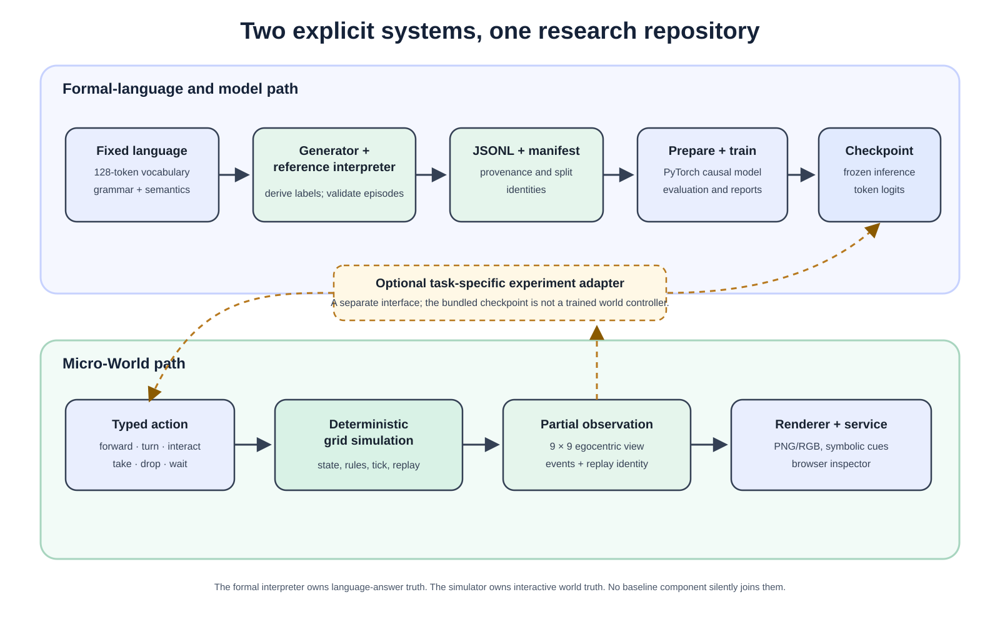

# Micro-Transformer System Architecture

**Status:** Baseline implemented  
**Purpose:** Define a small, modular architecture for language, simulation, dataset generation, transformer research, media observations, and browser inspection.

## 1. Design objective

Micro-Transformer is a machine-learning research environment, not a game. Its purpose is
to generate deterministic language tasks, train and evaluate a small transformer,
and expose the same world through inspectable visual and symbolic observations.

The architecture must therefore:

- keep the deterministic world independent from models and user interfaces;
- keep the 128-token language independent from dataset files;
- keep formal-language rules and grid-simulation rules explicit and separately testable;
- permit text, visual, and audio observations without changing world semantics;
- support exact replay from a seed and action sequence;
- allow components to be extended or replaced independently;
- remain simple enough for one developer to understand completely.

## 2. Architectural principle

Use one repository with two small Python namespaces and enforced dependency
boundaries. `micro_transformer` owns formal-language data; `micro_world` owns the
visual simulation. Do not create separate repositories or network services for
each component.

The implemented baseline has two explicit paths:

```text
formal language generator ---> reference interpreter ---> validated JSONL
                                                            |
                                                            v
                                                   prepare/train/evaluate

typed grid action ---> deterministic simulation ---> observation + events
                                                        |            |
                                                        v            v
                                                   visual data   sound cues
                                                        |
                                                        v
                                                service and inspector
```

The language reference interpreter owns dataset truth. The grid simulation owns
interactive world truth. They are intentionally separate baseline components and
must not be presented as one integrated interpreter.



The dashed adapter is an optional experiment-specific integration point, not an
existing trained connection between the language model and Micro-World.

## 3. Current repository structure

```text
micro-transformer/
├── pyproject.toml
├── README.md
│
├── micro-world/                   # Source root and visual demo boundary
│   ├── micro_transformer/
│   │   └── data/                  # Language, interpreter and corpus tooling
│   │       ├── generator.py
│   │       ├── coverage.py
│   │       ├── task_families.py
│   │       └── task_registry.py
│   ├── micro_world/
│   │   ├── protocol/              # Shared immutable gridworld types
│   │   ├── simulation/            # Authoritative deterministic gridworld
│   │   ├── media/                 # Canonical visual and sound observations
│   │   └── service/               # Thin browser-facing application layer
│   └── app/                       # Browser client; no world logic
│       ├── index.html
│       ├── viewer.js
│       └── viewer.css
│
├── models/                        # Standalone, copyable architectures
│   └── transformer.py             # Config, attention, blocks, optional LoRA
│
├── training/                      # Model training and evaluation tools
│   ├── configs/baseline.json
│   ├── prepare_data.py
│   ├── data.py
│   ├── train.py
│   ├── evaluate.py
│   ├── infer.py
│   ├── metrics.py
│   ├── objectives.py
│   ├── harness.py
│   ├── runtime.py
│   └── requirements.txt
│
├── scripts/                       # Thin command-line entry points only
│   ├── generate_dataset.py
│   ├── generate_colour_cases.py
│   └── run_inspector.py
│
├── tests/
│   ├── simulation/
│   ├── media/
│   ├── data/
│   ├── model_architecture/
│   ├── learning/
│   └── service/
│
├── docs/
│   ├── reference/                 # Human-facing language reference
│   ├── specifications/            # Architecture and formal specifications
│   ├── results/                   # Curated experiment summaries
│   └── concepts/                  # Documentation diagrams and rendered examples
│
└── artifacts/                     # Generated and normally git-ignored
    └── README.md                   # Runtime subdirectories are Git-ignored
```

The directories express ownership. They are not separate applications, packages, or deployment units.

## 4. Component responsibilities

### 4.1 Protocol

Defines the shared, serializable `WorldState`, `Action`, `Event`, `Observation`,
and `StepResult` types used by the interactive gridworld.

This module contains no simulation, rendering, generation, or model logic. It is the stable contract between components.

### 4.2 Formal language data

The `data` package owns the fixed 128-token vocabulary, token IDs, grammar,
reference interpreter, task families, and corpus validation. This symbolic
language environment is independent of the visual gridworld. Its public contract
is documented in `docs/reference/micro-transformer-language.md`.

### 4.3 Simulation

Owns world state, entities, tile effects, deterministic physics, time, day/night
state, visibility, and event production.

The simulation accepts typed actions rather than token strings. It must not import dataset, model, web, or training code.

The central interface should remain small:

```python
world = World.reset(seed=42, configuration=config)
result = world.step(action)
snapshot = world.snapshot()
observation = world.observe(agent_id="ava")
```

### 4.4 Media

Converts an agent observation into deterministic pixels and converts simulation
events into symbolic sound cues. It does not determine what the agent may perceive;
that decision belongs to simulation perception.

The Python visual renderer produces an exact low-resolution RGB array or PNG. The
browser redraws the same state with Canvas for human inspection.

### 4.5 Data

Builds procedural episodes by arranging symbolic world statements, actions,
questions, and expected answers. Every answer is derived from the package's
reference interpreter rather than supplied by a model.

This module owns quotas, task families, difficulty, structural train/validation/test splits, duplicate detection, coverage manifests, JSONL serialization, and corpus validation.

### 4.6 Models

Contains neural architectures and configuration only. The implemented model is a
small causal transformer whose parameters remain fixed during normal inference.

As of 8 September 2026, architectures live in the top-level `models/` directory.
The vanilla transformer, its configuration, and optional LoRA layers form one
self-contained `transformer.py` file. Training updates weights; normal inference
does not. Model parameter count is configurable for each experiment.

Model code must not contain Micro-Transformer language rules or expected answers.

### 4.7 Learning

Owns token encoding, batching, optimization, checkpoints, evaluation loops,
metrics, comparisons, and experiment outputs.

The implemented workflows live in top-level `training/`. A command loads the chosen
architecture file directly; copied variants do not need to be registered in a model
registry. Run-local checkpoints and the exact architecture copy live together under
`artifacts/runs/<run>/`.

It trains against prepared datasets produced by the canonical generator.

### 4.8 Service

Provides a thin FastAPI layer for interactive sessions. It coordinates existing components but implements no world rules.

Initial endpoints:

```text
POST /sessions
POST /sessions/{id}/step
POST /sessions/{id}/reset
GET  /sessions/{id}/state
GET  /sessions/{id}/observation/{agent}
GET  /sessions/{id}/events
WS   /sessions/{id}/stream
```

### 4.9 Browser inspector

Displays the grid, current observation, event log, tick, seed, and time of day. It
provides reset, step, play, speed, replay, and agent-selection controls.

The inspector uses native Canvas 2D and ordinary DOM elements initially. It must not calculate physics, visibility, answers, or model targets.

## 5. Dependency rules

Allowed dependencies are deliberately one-directional:

```text
data generator + reference interpreter ---> prepared datasets
models + prepared datasets -------------> training and evaluation

protocol ---> simulation ---> service ---> browser inspector
     |             |
     +-- media <---+
```

Required rules:

1. `protocol` imports no other Micro-World module.
2. `simulation` never imports `data`, `models`, `learning`, `service`, or browser code.
3. `data` does not import browser, service, training, or model code.
4. `media` renders an observation; it does not reveal hidden state.
5. `models` never encode correct world answers in handwritten rules.
6. `scripts` contain argument handling only and call library functions.
7. `micro-world/app` communicates through the service API and contains no authoritative logic.
8. Generated datasets and media are never imported as source code. Model loading
   may import the checksummed architecture snapshot saved alongside its checkpoint.

### 5.1 Composition interfaces

Components compose through their public data contracts rather than direct knowledge
of one another:

| Producer | Contract | Possible consumer |
|---|---|---|
| Formal language | Stable tokens, token IDs, grammar, and interpreter semantics | Corpus generators, token encoders, and evaluation tools |
| Dataset generator | Validated JSONL records and a provenance manifest | Data preparation, training, or an external analysis tool |
| Data preparation | Memory-mapped episode data and metadata | The baseline trainer or a replacement trainer |
| Model training | Checkpoint, architecture snapshot, configuration, metrics, and random state | Frozen inference, evaluation, LoRA, or a later experiment |
| Micro-World simulation | Typed actions, observations, events, replay records, visual arrays, and sound cues | The browser inspector or a user-defined model adapter |
| Service | JSON and WebSocket representations of simulation contracts | The included browser or another client |

These interfaces permit integration without selecting one required model-world
design. For example, an experiment may encode grid observations as language tokens,
consume the canonical pixel array with a visual encoder, or align sound cues with
events. The code that performs that translation is an experiment-specific adapter.
It must consume the existing contracts without moving model logic into the
simulation or world rules into the model.

## 6. Data and artifact separation

Source, reference material, and generated output must remain distinct:

| Category | Location | Version-controlled |
|---|---|---|
| Language and dataset implementation | `micro-world/micro_transformer/data/` | Yes |
| Language manual | `docs/reference/` | Yes |
| Architecture specifications | `docs/specifications/` | Yes |
| Documentation diagrams and rendered examples | `docs/concepts/` | Yes |
| Dataset-generation code | `micro-world/micro_transformer/data/` | Yes |
| Generated datasets | `artifacts/datasets/` | Normally no |
| Model definitions | `models/` | Yes |
| Training and evaluation tools | `training/` | Yes |
| Trained checkpoints and architecture snapshots | `artifacts/runs/<run-name>/` | Normally no |
| Run metrics and logs | `artifacts/runs/` | Normally no |
| Curated experiment summaries | `docs/results/` | Yes |
| Generated evaluation reports | `artifacts/reports/` | Normally no |

Every generated artifact must include provenance: seed, configuration, schema version, source revision, vocabulary version, and checksum.

## 7. Dataset record boundary

The stored training format should contain semantic fields rather than frontend state. A record may include:

```json
{
  "schema": "micro-transformer-jsonl-v4",
  "id": "train-000001",
  "seed": 42,
  "split": "train",
  "task": "state_tracking",
  "tokens": ["ava", "move", "cube", "one", "to", "hall", ".", "where", "cube", "one", "?", "hall", ".", "|"],
  "answer_tokens": ["hall"],
  "initial_state": null,
  "actions": null,
  "metadata": {
    "difficulty": "mixed",
    "language_version": "1.0",
    "simulation_version": "1.0"
  }
}
```

Optional state and action traces may be emitted for debugging datasets, but need not be present in compact training corpora.

Visual and audio observations should be generated from the stored seed and trace where practical, rather than duplicated into every text record.

## 8. Determinism and reproducibility

Given the same configuration, seed, initial state, and actions, Micro-World must produce identical:

- state transitions;
- events;
- text observations;
- expected answers;
- canonical visual arrays;
- canonical audio event descriptions.

Wall-clock time, browser frame rate, network latency, and frontend state must never influence the simulation.

Simulation time advances only through explicit fixed ticks.

## 9. Testing boundaries

Tests should mirror the architecture:

- **Data tests:** vocabulary size, stable token IDs, interpreter semantics, quotas,
  uniqueness, coverage, disjoint splits, provenance, and answer derivation.
- **Simulation tests:** actions, physics, time, visibility, and deterministic replay.
- **Media tests:** fixed visual observations for known states.
- **Model tests:** tensor dimensions, masking, parameter counts, serialization, and deterministic inference.
- **Learning tests:** a tiny corpus can overfit; checkpoints reload; metrics are correct.
- **Service tests:** API messages round-trip without changing semantics.

The browser is not used to validate core correctness.

## 10. Repository migration status

Completed by 9 September 2026:

- established the `micro_transformer` and `micro_world` package boundaries;
- moved the generator to `micro-world/micro_transformer/data/generator.py`;
- retained one canonical dataset command-line wrapper;
- moved generated datasets into `artifacts/datasets/`;
- moved the language manual into `docs/reference/`;
- moved visual concepts into `docs/concepts/`;
- moved generator tests into `tests/data/`;
- added project packaging, root documentation, and artifact ignore rules.

The vocabulary, reference interpreter, episode construction, and validation logic
live together in `micro-world/micro_transformer/data/`. This is the canonical formal-language
implementation used to produce training records.

The separate Gridworld v1 environment is now implemented under `protocol/`,
`simulation/`, `media/`, and `service/`, with the Canvas inspector under
`micro-world/app/`. Its contract is documented in `gridworld-v1.md`. It does not
yet replace the legacy generator's internal symbolic `World` class.

## 11. Baseline scope

The baseline contains:

- the fixed 128-token language;
- a reference interpreter for statements and questions;
- deterministic world state;
- a 16×16 top-down grid;
- walls, floors, doors, water, ice, directional tiles, and rotating tiles;
- fixed simulation ticks and a day/night cycle;
- agent-centred partial observations;
- procedural text episodes and exact validation;
- a small transformer baseline;
- symbolic sound cues;
- a minimal Canvas inspector.

## 12. Acceptance criteria

The architecture is correctly separated when:

1. The simulator runs headlessly without FastAPI, JavaScript, or PyTorch.
2. The dataset generator validates every expected answer with its reference interpreter.
3. The browser can be removed without affecting generation, training, or evaluation.
4. A model can be replaced without changing language or simulation code.
5. Visual rendering and sound-cue generation consume authoritative simulation output.
6. A saved seed and action sequence can be replayed exactly.
7. No component outside simulation can silently alter authoritative world state.
8. Command-line tools remain thin wrappers around tested package APIs.

This structure keeps Micro-Transformer unified as one research project while
preserving Micro-World as the name and boundary of its visual environment. Language,
datasets, models, simulation, and presentation remain independently testable.
