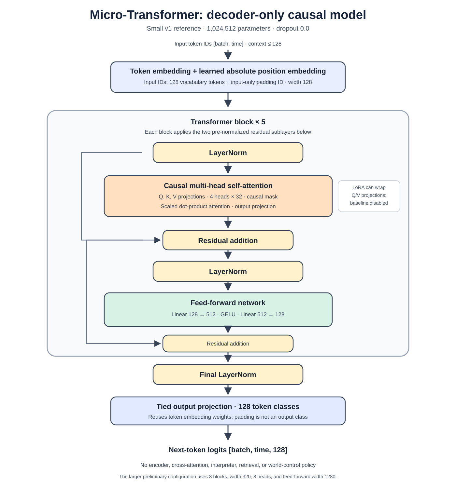

# Transformer architecture

The implemented neural model is a small decoder-only causal transformer in
[`models/transformer.py`](https://github.com/vimalnar/micro-transformer/blob/main/models/transformer.py). It predicts the next token
in a fixed formal language. The model implementation does not contain the
language's interpreter or handwritten answer rules.



*Small v1 reference configuration. The optional LoRA path is shown only as an
extension; it is disabled in the baseline checkpoint.*

## Forward path

For a batch of token IDs shaped `[batch, time]`:

1. Look up a learned token embedding and a learned absolute position embedding.
2. Add the embeddings and apply embedding dropout.
3. Pass the sequence through `n_layers` pre-normalized transformer blocks.
4. Apply the final layer normalization.
5. Project to the 128 language-token logits using the token embedding matrix as
   the tied output matrix.

The result has shape `[batch, time, vocab_size]`. Padding ID `vocab_size` is
available only to input embedding and is not predicted.

## Transformer block

Each block applies two residual updates:

```text
x = x + dropout(causal_self_attention(layer_norm(x)))
x = x + dropout(feed_forward(layer_norm(x)))
```

Attention uses separate learned linear projections for queries, keys, values and
the output. The hidden width is split evenly across heads. PyTorch's
scaled-dot-product attention is called with a causal mask, so a position cannot
attend to later positions. Attention dropout is enabled only while the module is
in training mode.

The feed-forward path expands from `d_model` to `d_ff`, applies GELU, then projects
back to `d_model`. Both sublayers use their own layer normalization. Residual output
projections use a depth-scaled initialization.

## Position, padding and episode boundaries

Positions use learned absolute embeddings. There is no rotary embedding or
relative-position mechanism in the current implementation. Each training example
is an independent episode, right-padded in a batch. Causal attention plus
right-padding ensures later padding cannot alter the outputs at valid earlier
positions; the training objective separately masks padding targets.

Episode boundaries are represented by the formal language's `|` token. The first
input token is used as context; there is no separate beginning-of-sequence token.
The model's context is capped at its configured `context_length` and generation
raises an error rather than silently truncating input.

## Reference configurations

| Setting | Small v1.0.0 | Larger preliminary reference |
| --- | ---: | ---: |
| Layers | 5 | 8 |
| Hidden width | 128 | 320 |
| Attention heads | 4 | 8 |
| Head width | 32 | 40 |
| Feed-forward width | 512 | 1280 |
| Context | 128 | 128 |
| Dropout | 0 | 0 |
| Output classes | 128 | 128 |
| Parameters | 1,024,512 | 9,946,560 |

Both configurations have bias enabled and tied input/output embeddings. See the
[model specifications](model-specifications.md) for checkpoint availability and
evaluation status.

## Generation

`Transformer.generate` runs under inference mode. With temperature zero it uses
greedy argmax; with positive temperature it samples from the temperature-scaled
softmax. It stops when all batch rows emit the requested end token or the token
budget is reached. It restores the model's previous train/eval mode afterward.

The user-facing harness adds stricter prompt validation: exactly one question
ending in `?`, no user-supplied `|`, only known vocabulary items, and context within
128 tokens. These are harness conventions layered over the general tensor-level
`generate` method.

## LoRA extension

`enable_lora` can wrap selected `nn.Linear` modules (by default query and value
projections) with a low-rank update:

```text
y = W x + (alpha / rank) B A x
```

The base model parameters are frozen; adapter matrices are trainable. Adapter
weights can be extracted with `adapter_state_dict()` and merged into ordinary
linear weights for inference. This facility is implemented in the architecture
and training stack. It does not mean the bundled inference checkpoint contains
or uses LoRA.

## Extension guidance

The architecture file is intentionally self-contained and can be copied for a
controlled variant. For a causal architecture comparison, train candidate and
baseline from fresh initialization while holding data bytes, seeds, optimizer,
step budget, checkpoint selection, and evaluation suites fixed. Starting from the
frozen checkpoint with LoRA tests adaptation, not a from-scratch architecture
change. See the [experiment guide](../guides/experiment-guide.md).
